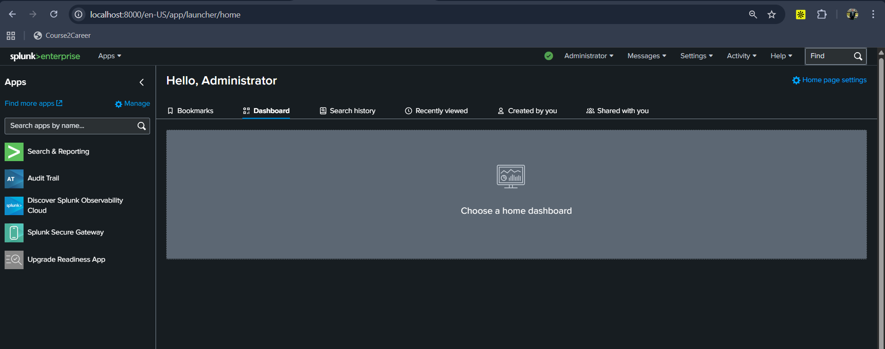
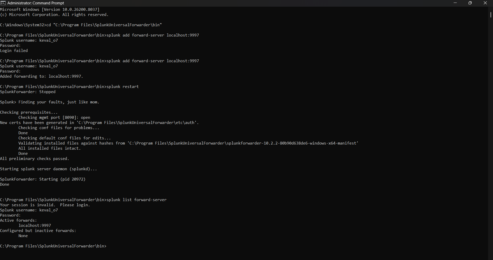
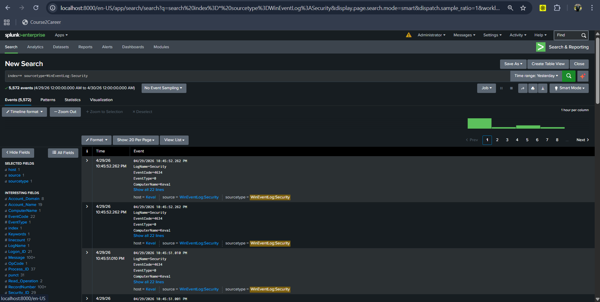
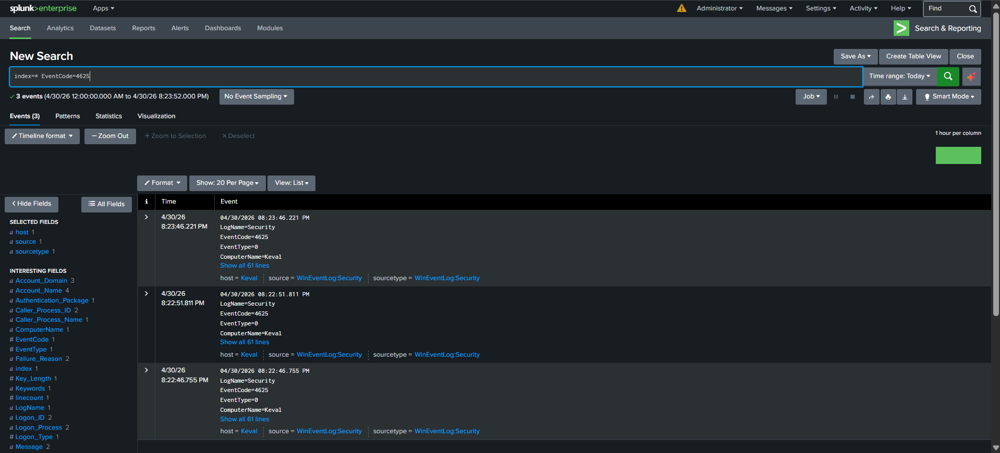
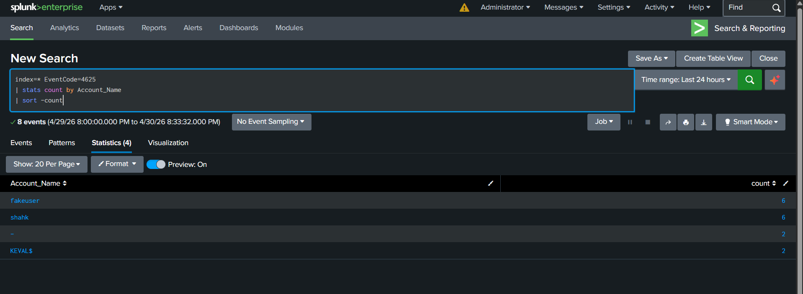
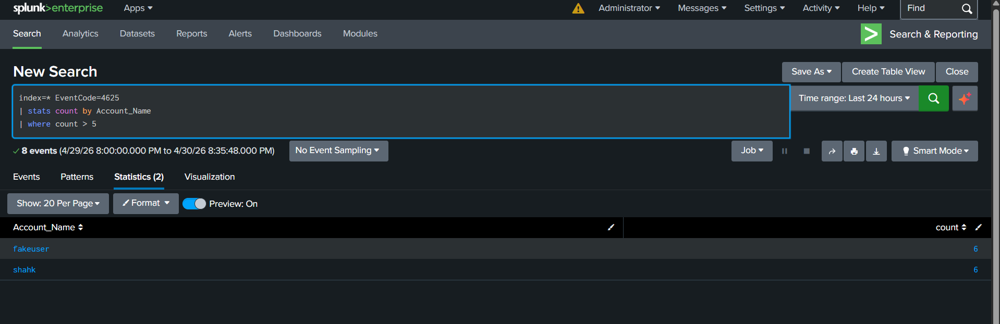
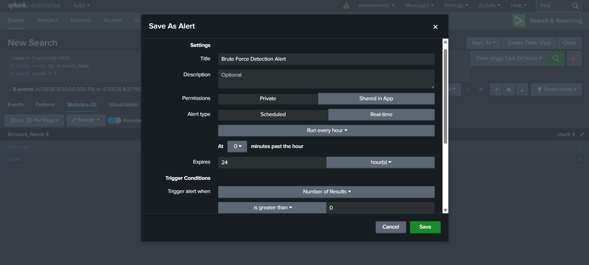
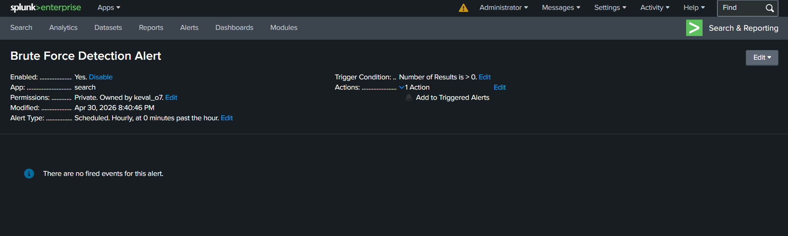
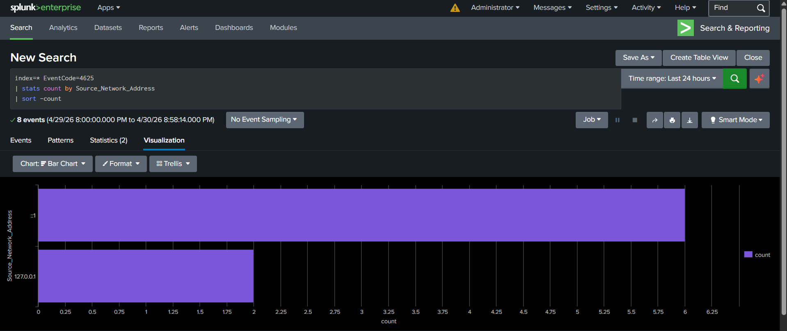

# soc-splunk-lab

# 🛡️ SOC Analyst Lab – Using Splunk SIEM to detect brute-force attacks and analyse security logs.

## 📌 Project Overview
This project simulates a real-world **Security Operations Centre (SOC)** environment using Splunk SIEM to monitor, detect, and analyse security events.

The primary focus is on identifying **brute-force attack patterns** by analysing Windows Event Logs and building detection logic, alerts, and dashboards.

---

## 🎯 Objectives
- Ingest and analyse Windows Event Logs using Splunk
- Detect suspicious authentication behaviour (failed login attempts)
- Develop detection rules aligned with SOC workflows
- Create alerts for real-time threat monitoring
- Visualise attack patterns through dashboards

---

## 🧰 Tools & Technologies
- **SIEM:** Splunk Enterprise  
- **Log Collection:** Splunk Universal Forwarder  
- **Data Source:** Windows Event Logs  
- **Query Language:** SPL (Search Processing Language)  

---

## 🏗️ Architecture
Windows Machine → Splunk Forwarder → Splunk SIEM → Detection & Dashboard

---

## 🔍 Use Case: Brute Force Attack Detection

### 📖 Scenario
An attacker attempts to gain unauthorised access by repeatedly trying incorrect passwords for a user account.

---

### 🧪 Data Source
- Windows Security Logs  
- Event ID: **4625 (Failed Login)**  

---

### 🧠 Detection Logic

``spl
index=* EventCode=4625 
| stats count by Account_Name
| where count > 5``

💡 Explanation

This query identifies accounts with multiple failed login attempts.
A high number of failures within a short time window is a strong indicator of a brute-force attack.

## 🚨 Alerting Strategy

-**🔹Alert Name:** Brute Force Detection Alert
-**🔹Trigger Condition:** Number of results > 0
-**🔹Schedule:** Runs every 5 minutes
-**🔹Purpose:** Detect and notify suspicious authentication behaviour in near real-time

## 📊 Dashboard Overview

The dashboard provides a high-level view of security events.
-**Key Panels:**
📈 Failed Login Trends Over Time
👤 Most Targeted User Accounts
🌐 Top Source IP Addresses

## 📸 Screenshots & Project Walkthrough

### 🔹 1. Splunk SIEM Setup

Splunk Enterprise successfully deployed and running locally, providing the interface for log ingestion, analysis, and monitoring.

---

### 🔹 2. Forwarder Configuration

Splunk Universal Forwarder configured and connected to the Splunk instance, enabling real-time log forwarding from the host machine.

---

### 🔹 3. Log Ingestion

Windows Event Logs successfully ingested into Splunk, forming the foundation for security monitoring and analysis.

---

### 🔹 4. Failed Login Detection

Identification of failed login attempts (Event ID 4625), which serve as key indicators of potential brute-force attacks.

---

### 🔹 5. Detection Query Development

Aggregation of failed login attempts by user to identify accounts experiencing repeated authentication failures.

---

### 🔹 6. Suspicious Activity Identification

Application of detection thresholds to highlight suspicious behaviour, flagging accounts with excessive failed login attempts.

---

### 🔹 7. Alert Configuration

Creation of a scheduled alert to automatically detect and respond to brute-force attack patterns.

---

### 🔹 8. Alert Triggering

Successful triggering of alerts upon detection of suspicious login activity, simulating real-world SOC alerting workflows.

---

### 🔹 9. Splunk Source IP Alert

Successful triggering of alerts and detection of suspect's IP Address, simulating real-world SOC alerting workflows.

---

### 🔹 10. SOC Dashboard

Custom dashboard visualising failed login trends, targeted accounts, and attack sources for effective security monitoring.

---

## 🧠 Key Learnings

-🔹SIEM deployment and log ingestion using Splunk
-🔹Writing detection queries using SPL
-🔹Identifying brute-force attack patterns
-🔹Creating alerts for security monitoring
-🔹Visualising security data through dashboards

## 🔐 Security Concepts Applied

-🔹Threat Detection
-🔹Log Analysis
-🔹Incident Monitoring
-🔹Authentication Security
-🔹Basic SOC Operations

## 🚀 Future Improvements

-🔹Map detections to MITRE ATT&CK framework
-🔹Add detection for:
 -   🔹Successful login after multiple failures
  -  🔹Suspicious PowerShell activity
-🔹Integrate automated response workflows
-🔹Expand to multi-source log ingestion

## 📎 Project Value

This project demonstrates practical, hands-on experience in:
-🔹SIEM tools used in industry
-🔹Detection engineering fundamentals
-🔹Security monitoring workflows

## 🔗 Author

**Keval Shah**
**Cybersecurity Graduate | SOC Analyst Aspirant**

GitHub: https://github.com/keval-o7/
LinkedIn: https://linkedin.com/in/keval-shah-profile
